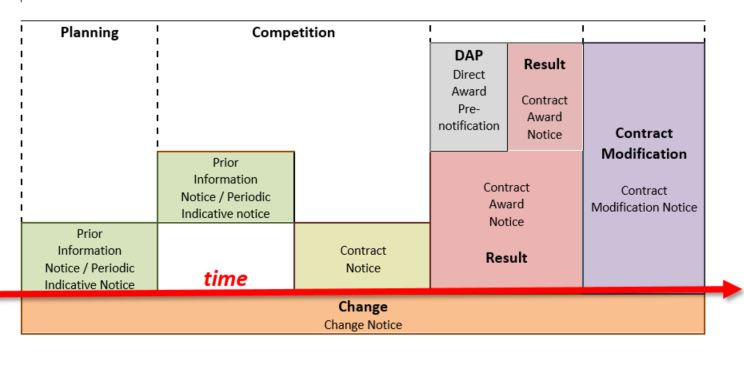

//:doctitle: The TED Open Data Service
:doccode: sws-main-prod-001
:author: NPJ
:authoremail: nicole-anne.paterson-jones@ext.ec.europa.eu
:docdate: September 2023

[.text-center]
= TED Open Data

== What is the TED Open Data Service?

[sidebar]
--
The TED Open Data Service continuously converts notices from the XML standard form format available on the TED Website into RDF format. The data is stored in the Publications Office's (OP) triple store named the "Cellar", and is publicly available or "open". 

Making TED data open for querying is part of the https://digital-strategy.ec.europa.eu/en/policies/strategy-data[European Data Strategy] which is working towards connecting EU data across sectors for the benefit of citizens, businesses, researchers, and public administrations, to name a few.

--

[.tile-container]
--

[.tile]
.Query TED Open Data

****
Resources and links for querying TED Open data

xref:querying:index.adoc[Query TED open data using SPARQL]
****

[.tile]
.Connect to TED Open Data

****
Methods of connecting to TED open data

xref:connecting:index.adoc[Connecting to TED open data using Excel or Python]
****

[.tile]
.View Sample Queries

****
Use or adapt the sample SPARQL queries available

xref:samples:index.adoc[Browse the sample queries provided]
****

[.tile]
.Create Mapping Suites (XML to RDF)
****
Convert XML data into RDF

xref:mapping:index.adoc[Create mappings to convert XML data into RDF]

****
--

////
=== Querying TED Open Data

[sidebar]
--
Anyone, with a little know-how, and with help from the resources provided, can learn to create their own queries, and benefit from data on EU public procurement. Queries can be submitted via Cellar's https://publications.europa.eu/webapi/rdf/sparql[SPARQL endpoint], for which there is a link on the https://op.europa.eu/en/web/eu-vocabularies[EU Vocabularies page].

This section on querying (reusing) public procurement data introduces the resources and guides available to help those interested improve their querying knowledge and skills.
--

=== Learn how to query TED RDF data

[.tile-container]
--

[.tile3]

.Tutorials

****

xref:sample_app/tutorials.adoc[Tutorials]

****

[.tile3]

.Guidance

****

xref:sample_app/guidance.adoc[Tips and Guidance]

****

[.tile3]

.Snippets

****

xref:sample_app/snippets.adoc[Reusable code snippets]

****

[.tile3]

.Scenarios

****

xref:sample_app/scenarios.adoc[Turn your question into a Query]

****

[.tile3]

.Examples

****

xref:sample_app/sparql_queries.adoc[Examples]

****

--

== Data currently available

=== Time Period

Data is currently available from August 2023 to December 2023

=== Notice Types

Data is currently available from *Contract Award Notices* in the above time period

NOTE: Data, which includes that generated daily going forward and data going back in time is being constantly added to Cellar

Notice types and where they fit in in the public procurement process

For an overview of what data can be extracted from a Contract Award Notice, you can use the search facility on the https://ted.europa.eu/en/[TED website], choosing "Advanced Search" (All Notices), then "Result", and look at the contents of a Contract Award Notice.

'''
=== Try submitting a query in the SPARQL EndPoint

[.tile-container]
--

[.tile]

.Copy a Query

****

image::query_tile.png[xref=sample_app/examples.adoc,width=260]

****

[.tile]

.Paste a query into the Cellar SPARQL EndPoint

****

image::endpoint.png[link=https://publications.europa.eu/webapi/rdf/sparql,width=220]

****

--

'''

[.tile-container]
--

[.tile0]

.Ask the community for help

****

Need help with a query or understanding the data? +

Post your question on the https://github.com/OP-TED/ted-rdf-docs[RDF query discussion forum] and ask the community for help

****

--

'''

== Mapping Suites

[sidebar]
--
The Mapping Suites section is for those who wish to use a service that converts XML data into RDF, and deals with the creation of mappings or mapping suites for this purpose. This section is aimed at technical users wishing to create rules for data conversion from XML to RDF. Mappings and mapping suites are part of the the "behind the scenes" process that precedes RDF data being placed in the OP's Cellar triple store for querying. Here the process converts TED Notice data, in XML format, into RDF triples that are stored in Cellar.
--

=== Resources for creating Mappings

[.tile-container]
--

[.tile6]

.Methodology

****

image::methodology.png[xref=mapping_suite/methodology.adoc,width=51,height=51]

//<<ODS:ROOT:sample_app:tutorials.adoc#, Methodology>>

****

[.tile6]

.Mappings

****

image::mapping.png[xref=mapping_suite/index.adoc,width=51,height=51]

****

[.tile6]

.Mapping Suites

****

image::mapping_suites.png[xref=mapping_suite/mapping_suite_structure.adoc,width=51,height=51]

****

[.tile6]

.Repository Structure

****

image::repository.png[xref=mapping_suite/repository_structure.adoc,width=51,height=51]

****

[.tile6]

.Toolchain

****

image::toolchain.png[xref=mapping_suite/toolchain.adoc,width=51,height=51]

****

[.tile6]

.Preparing Test Data

****

image::testdata.png[xref=mapping_suite/preparing-test-data.adoc,width=51,height=51]

****

--

=== Code Examples

[sidebar]

--

(add examples)

--

////

