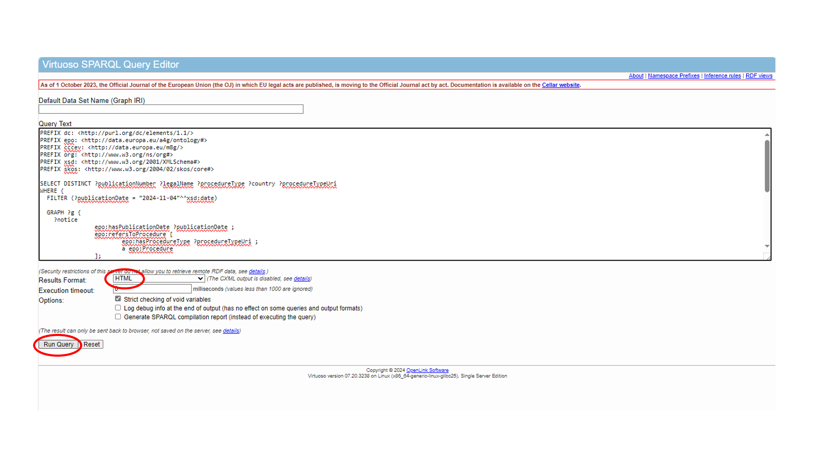
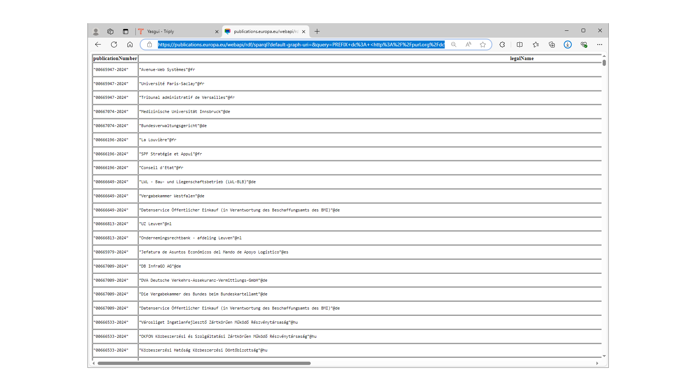
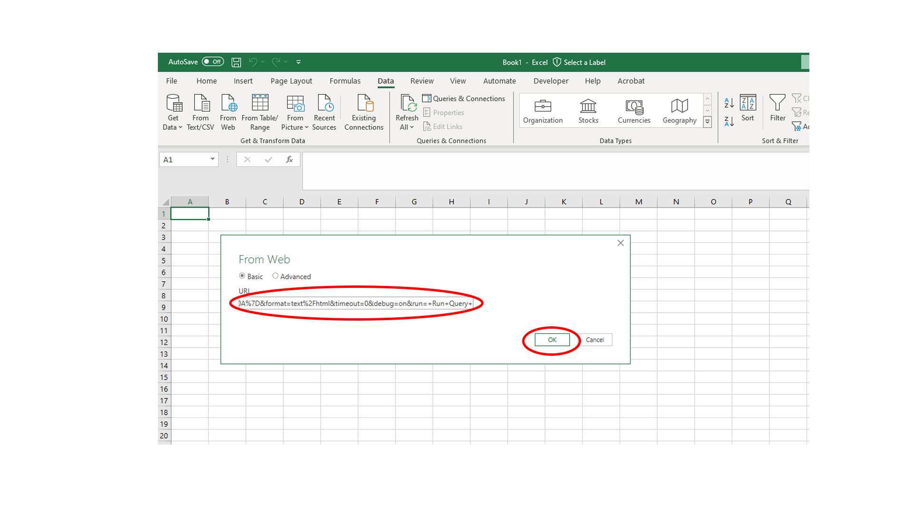
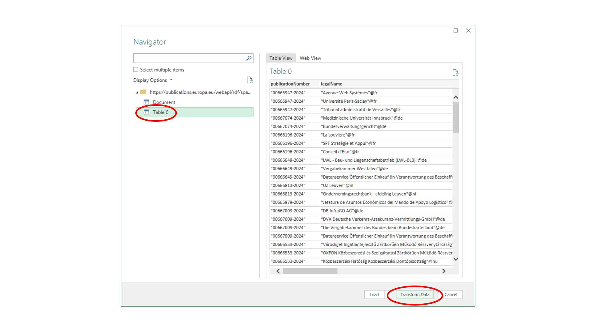
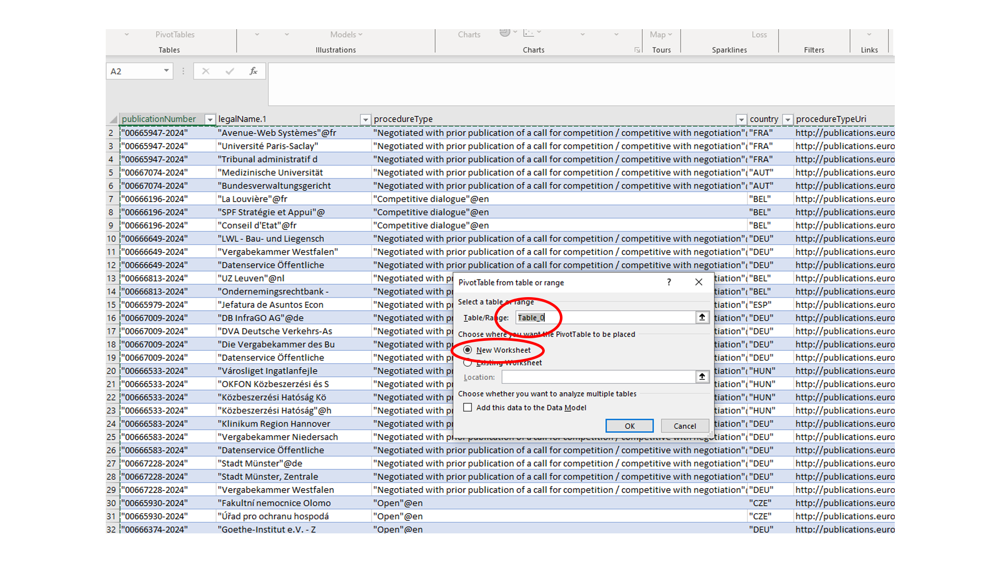
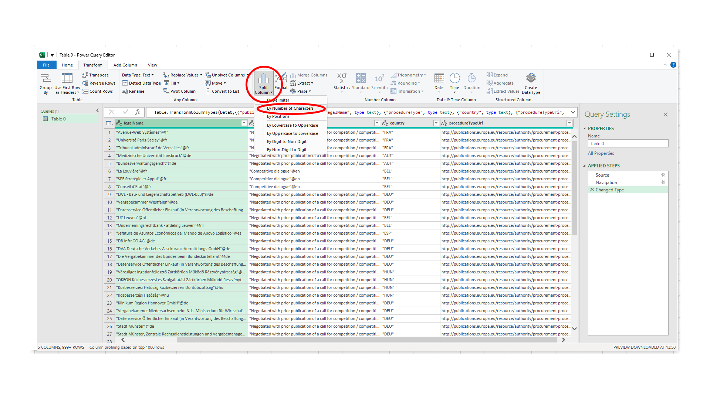
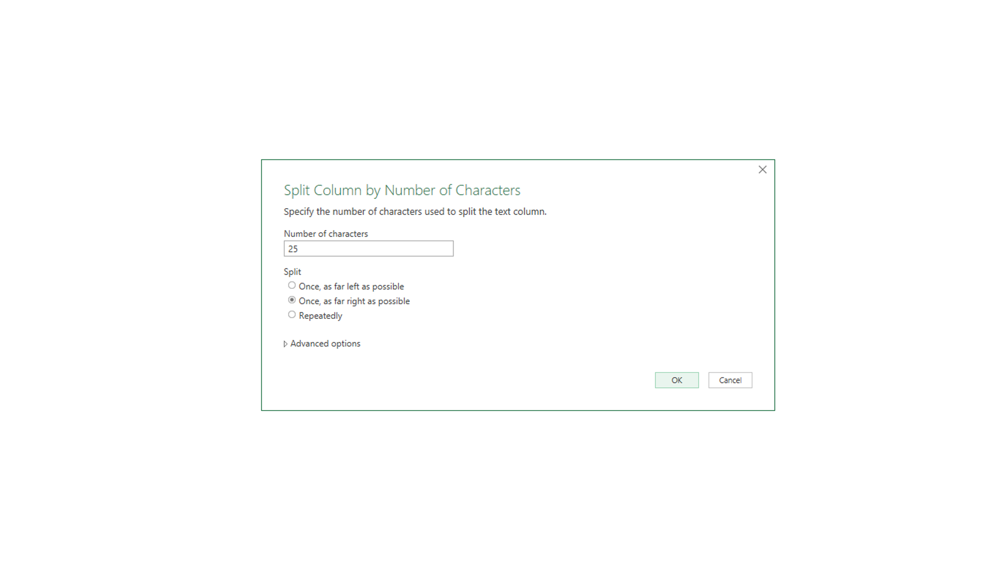
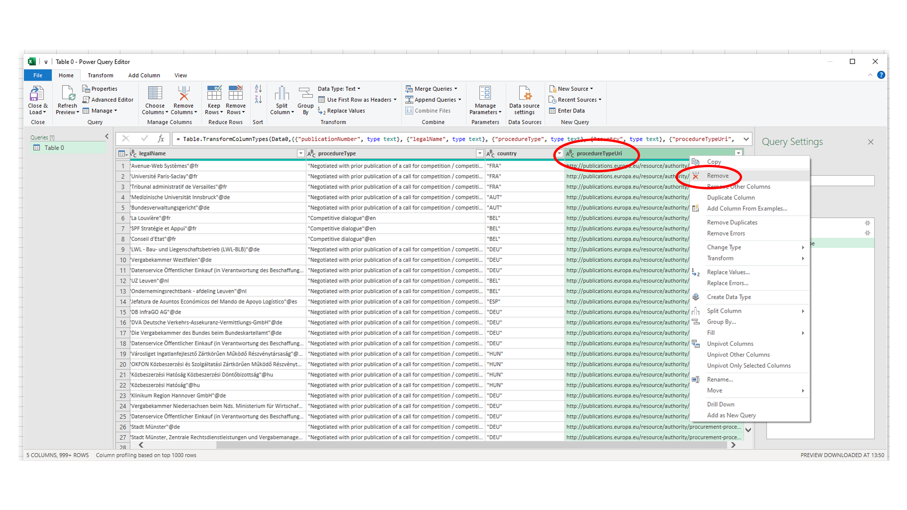
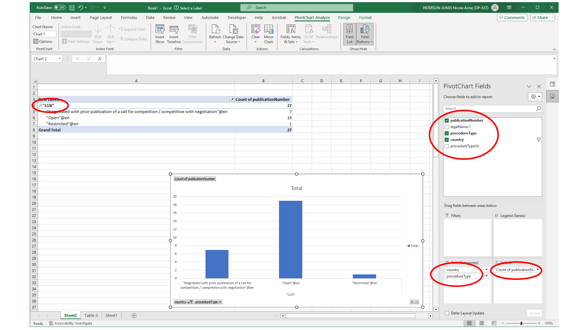

:doctitle: Querying the data using Excel
:doccode: ODS-CONN-03
:author: NPJ
:authoremail: nicole-anne.paterson-jones@ext.ec.europa.eu
:docdate: September 2023

There are two parts to querying the data using Excel. 

== Part 1 of this query method

The first part is described on the page: xref:sparql.adoc[Submitting a query in the Cellar SPARQL Endpoint].

//video::P9IgUoJ3L60[youtube, width=720, height=540]

NOTE: When submitting your query, be sure that you choose the first results format option in the dropdown list, *HTML*.

== Part 2 of this query method

. Start by running the query in the SPARQL EndPoint

[start=2]
. Once the EndPoint has returned the results of the query, copy the url of the results page to the clipboard

[start=3]
. Open a new spreadsheet in Microsoft Excel. Go to the *Data* tab and choose "from Web" on the Data menu

[start=4]
. Paste the copied query results into the window that pops up and click "OK". A new window will appear requiring you to choose the sheet you wish to look at. The sheet you want is the generated one, "Table 0". Choose "Table 0" and click on "Transform Data"

"Transform Data" will open a Power Query window that will allow you to delete the columns you do not wish to keep and to do some manipulation of the data before it is transferred to the Excel sheet. Click "Close and Load" when you are finished.

[start=5]
. Now you can perform some data manipulations in the spreadsheet like splitting columns by various parameters

Here we show splitting by number of characters

And removing/ deleting a column

[start=6]
. From the ribbon menu, choose "Close and Load". This will save your settings and return you to the new pivot table.

. Once the data is loaded into a new spreadsheet, select the publicationNumber cell

.	Click Insert, select Pivot Table, choose table 0 as The Table/Range and select New worksheet. This will open a new worksheet with an empty pivot table.

#add image#

Now you can manipulate the pivot table to display, in this example,the number of competition notices, per procurement type, per country

[start=7]
. Choose the data for the pivot table: Select country and procedureType (country on top of procedureType) as Rows and publicationNumber for Values (it will be count of publicationNumbers). This will display the data in the pivot table.

. Create a bar chart from the data: Select Row Labels. then click Insert, 2-D columns, and choose the Clustered Columns chart type - this will insert a new chart on the same page. You can drill down by selecting a specific country and showing the number of specific type of procedures for that country. If you switch the order of rows (procedureType on top of the country) then you can drill down by procedureType.
. Filter the country by e.g., Luxembourg (Lux)

If you save this query in Excel, the data will be refreshed the next time you open the file. You can also refresh the data anytime by clicking on "Refresh" on the *Data* menu.

//video::G_7cCGQaICY[youtube, width=720, height=540]

include::ROOT:partial$feedback.adoc[]