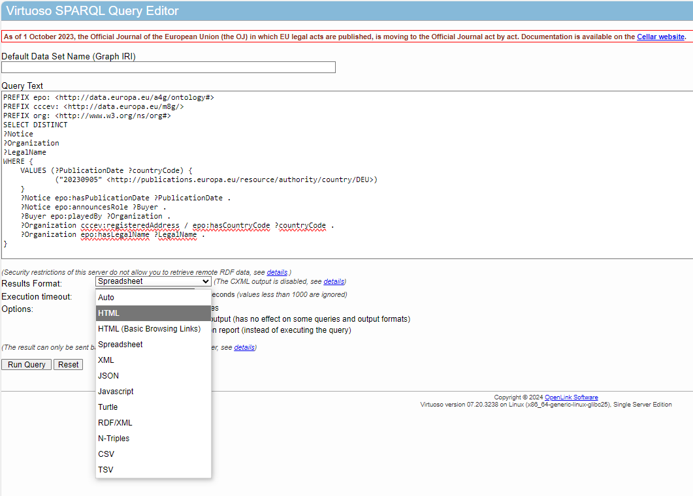
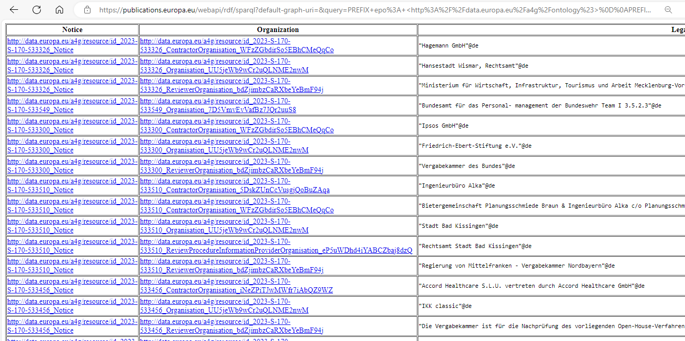

= Querying Data directly in the Cellar SPARQL Endpoint

== Cellar SPARQL Endpoint

* HTML: 

* HTML (basic browsing links):

* Spreadsheet: Returns a HTML file

* XML

* JSON:

* Javascript:

* Turtle:

* RDF/XML:

* N-triples

* CSV:

* TSV:

The query (Query sample 3) is pasted into the "Query Text" field. This query returns a list of companies that have won a tender/ contract published on a certain date.
This returns the results below:

Below is a short video of the query submission. The HTML results option will be used again in the Microsoft Excel query method.

#add video of query submission#